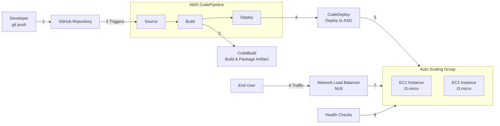

AWS CI/CD Pipeline for a .NET Core Service

This project automates the deployment of a .NET Core application to an Auto Scaling Group behind a Network Load Balancer on AWS, using a full CI/CD pipeline with GitHub as the source, integrated with AWS CodeBuild, CodeDeploy, and CodePipeline.
📖 Table of Contents

    Project Overview

    Architecture Diagram

    Infrastructure Components

    Application

    CI/CD Pipeline Flow

    Prerequisites

    Setup & Deployment Instructions

    Repository Structure

    Cleaning Up
                                                                  
🚀 Project Overview

The goal of this project is to demonstrate Infrastructure as Code (IaC) and CI/CD best practices on AWS. The infrastructure, including networking, security, and compute resources, is provisioned using AWS CLI bash scripts. A simple .NET Core web service is automatically built, tested, and deployed whenever changes are pushed to the main branch of the GitHub repository.

